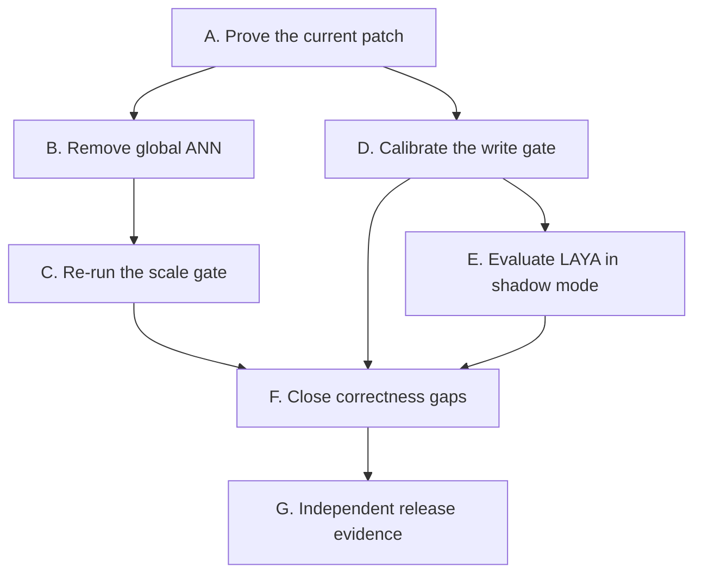

# VerityMem v0.1 — remaining implementation plan

Status: execution plan after the local read-path latency hardening on
`codex/local-latency-hardening`.

This document is intentionally narrower than a product roadmap. It lists the work
required to turn the current preview into an honestly measurable v0.1, in dependency
order, with acceptance conditions a coding harness can execute. A task is not complete
because its code exists; it is complete only when its stated evidence exists.

## Non-negotiable invariants

Every task must preserve these boundaries:

1. Evidence is canonical; claims and indexes are rebuildable projections.
2. A model may propose or score. It may never set a claim to `accepted`.
3. Authorization is resolved before retrieval and rechecked before use.
4. Authority, entailment, freshness, conflicts, extraction confidence and use policy
   remain separate signals. Do not add a synthetic `confidence` field.
5. The default read path performs no learned-model call.
6. A deletion is complete only after the residual scan returns zero.
7. No performance or security target is reported as passing without the specified run.

## What the current latency patch changes

The current branch removes several deterministic latency multipliers:

- request scope reachability is computed once per transaction instead of inside the
  row-level security predicate for every candidate row;
- entity retrieval uses a canonical-to-claim inverted index instead of joining each
  matching alias to every claim in a tenant;
- query embedding begins before a database connection is checked out;
- dense retrieval runs alongside one bounded ordinary-channel lane;
- hydration and query-trace persistence share one request transaction;
- projection rebuild records its version once rather than once per claim;
- workers immediately claim the next batch while useful backlog remains;
- the local Compose database has explicit, overrideable memory defaults.

These are verified by typechecking and focused unit tests. They are **not yet verified
against a live migrated database or the million-claim corpus**. The global HNSW graph is
also still shared across tenants. Therefore this branch is a candidate fix, not a
performance result.

## Execution order



Do not start integration work on LAYA before task D2 creates a held-out labelled set.
Otherwise the model will be tuned and scored on policy-generated labels, producing a
circular benchmark.

## Workstream A — prove the latency patch on PostgreSQL

### VM-A1 — fresh-database migration and RLS semantics

**Depends on:** nothing.

**Files:** `migrations/0014_precomputed_scope_reach.sql`,
`migrations/0015_claim_entity_index.sql`, database integration tests under
`packages/retrieval/src/`.

**Work:**

- Start the repository's PostgreSQL 17/pgvector Compose service.
- Apply all migrations as the migration role.
- Run tests as `veritymem_app`, which must not have `BYPASSRLS`.
- Add integration cases proving project-to-user reach, no user-to-project widening,
  purpose denial, tenant denial, system context remaining tenant-bound, and identical
  results before and after the precomputed closure.
- Add entity cases for subject strings, scalar JSON string objects, non-string objects,
  revoked claims and two tenants using the same alias.

**Accept when:**

- `pnpm migrate:verify`, `pnpm typecheck` and `pnpm test` exit 0;
- an unbound connection reads zero tenant rows;
- every authorization test executes under the non-superuser application role;
- the entity channel returns the same authorized claim IDs as the pre-migration query on
  a small golden corpus.

### VM-A2 — existing-database upgrade rehearsal

**Depends on:** VM-A1.

**Work:** restore a production-shaped snapshot at migrations 0001–0013, then time and
observe migrations 0014–0015. Record table locks, WAL growth, temporary disk, peak disk,
backfill rate and rollback behavior. Migration 0015 performs a bulk backfill and primary
key build; assuming it is operationally harmless would be irresponsible.

If the migration blocks writers beyond the agreed local/production budget, split it into:

1. create table and non-unique indexes;
2. resumable tenant/range backfill with a progress table;
3. verify duplicates and missing mappings;
4. create the unique index concurrently;
5. attach the constraint and switch reads;
6. remove compatibility code in a later migration.

**Accept when:** the rehearsal report names row counts, duration, maximum lock duration,
WAL bytes, extra disk required and the exact rollback/retry procedure.

### VM-A3 — channel-level plan capture

**Depends on:** VM-A1.

**Work:** extend `packages/perf` with an `explain` subcommand that captures
`EXPLAIN (ANALYZE, BUFFERS, WAL, SETTINGS, FORMAT JSON)` for lexical, entity, temporal,
relation, dense, hydration and scope binding. Store plan digests plus PostgreSQL,
pgvector, schema and commit versions.

Do not expose fine-grained timings in the public query response; cross-tenant timing is a
security signal. Plans belong in protected benchmark artifacts and query traces.

**Accept when:** one command produces machine-readable plans for every channel, and a
regression test fails if the entity plan loses its `claim_entities` lookup or scope
binding returns to per-row catalog reads.

## Workstream B — remove the global ANN root cause

PostgreSQL filtering and a B-tree on `tenant_id` do not make a global HNSW graph
tenant-local. Approximate search may traverse global candidates before ordinary filters
are applied. More cache makes that faster but does not remove the cross-tenant latency
dependency.

### VM-B1 — build an adaptive dense-search benchmark

**Depends on:** VM-A3.

**Work:** for tenant sizes 100, 1k, 10k, 100k and 1M, compare:

- exact cosine distance after tenant/model/authorization filtering;
- tenant-local HNSW with several `ef_search` values;
- `halfvec` and binary-quantized candidate generation followed by full-vector rerank.

Measure p50/p95, recall@10, buffers, index bytes and cold/warm behavior. Never choose an
ANN configuration using latency alone; a fast index that loses the gold claim fails.

**Accept when:** the report selects an exact-to-ANN crossover threshold on a declared
machine and includes recall as well as latency.

### VM-B2 — tenant-local vector storage

**Depends on:** VM-B1.

**Preferred design:** make `claim_embeddings` list-partitioned by `tenant_id`.

- Small tenants remain in a default partition with a tenant/model B-tree and use exact
  distance; the default partition has no HNSW index.
- When a tenant crosses the measured threshold, a maintenance job creates a dedicated
  tenant partition, moves that tenant atomically, builds HNSW on that partition, records
  its index parameters and updates the dense projection version.
- Partition creation is control-plane work. Never create DDL from an agent request.
- Dense query planning chooses exact or ANN from recorded projection metadata; it does
  not infer strategy from caller input.

A hash bucket partition is **not** sufficient: it reduces index size but keeps other
tenants in the same ANN graph, so the timing dependency remains.

**Accept when:**

- a tenant equality predicate prunes to exactly one physical partition;
- small tenants use an exact plan and large tenants use only their local HNSW index;
- adding one million vectors to tenant B does not materially change tenant A's plan,
  candidate count, result IDs or latency distribution;
- replay/rebuild and verified deletion include every partition;
- no DDL privilege is present on the agent-facing database role.

### VM-B3 — production-safe dense migration

**Depends on:** VM-B2.

**Work:** implement dual-write, backfill, digest comparison, read cutover and old-index
retirement as separately reversible steps. A one-shot table rewrite is not acceptable.

**Accept when:** the old and new dense projections produce the same authorized top-k on a
gold corpus within the declared ANN recall tolerance, and a failed cutover can return to
the old projection without replaying the ledger.

## Workstream C — rerun and enforce the scale gate

### VM-C1 — produce a complete reference corpus

**Depends on:** VM-B3.

**Work:** load a fresh tenant with 1,190,477 events, claims, spans, evidence rows and
embeddings. Refuse to benchmark if any required count or projection-version row is
missing. Preserve the manifest, seed and phase checkpoints as artifacts.

**Accept when:** the preflight count verifier passes and the manifest hashes every input,
model/config artifact and generated report.

### VM-C2 — publish the reference machine and latency result

**Depends on:** VM-C1.

**Work:** declare CPU, RAM, storage, OS, Docker limits, PostgreSQL/pgvector settings and
cold/warm protocol. Run at least 600 queries with concurrency 1 and 4 over every query
shape. Publish failures and timeouts in the denominator.

**Accept when:** default non-model reads meet p95 <250 ms at one million accepted claims,
or the v0.1 release gate remains failed. Do not raise `statement_timeout` to turn a
timeout into a result.

## Workstream D — calibrate the production write gate

### VM-D1 — correct the labelled corpus before tuning

**Depends on:** VM-A1.

**Work:** separate fixture expectations that encode lexical-backend behavior from claims
that a human adjudicator would accept. Add cross-sentence coreference and wrong-entity
entailment cases. Split by scenario/subject, not by individual candidate, to prevent near
duplicate leakage.

**Accept when:** the corpus has immutable train, calibration and held-out test manifests;
the test split is hidden from threshold selection.

### VM-D2 — build the 500-trace human audit set

**Depends on:** VM-D1.

**Work:** double-label at least 500 stratified admission, candidate, decision and query
traces; adjudicate disagreements; retain label provenance. An LLM may suggest labels but
cannot count as either required human label.

**Accept when:** agreement, disagreement and adjudication rates are published by stratum.

### VM-D3 — calibrate the pinned ONNX verifier

**Depends on:** VM-D2.

**Work:** fit entailment/contradiction thresholds only on the calibration split, record
the calibration artifact hash with the model/tokenizer/normalizer hashes, then run the
held-out set once. Batch candidates from one event.

**Accept when:** the production backend, not the lexical stand-in, satisfies the unsafe
auto-accept, contradiction, review-burden and write-latency gates on held-out/reference
workloads. If it does not, keep it opt-in and report the failure.

## Workstream E — evaluate LAYA without weakening the boundary

### Decision

LAYA is potentially useful as a **fast typed-decision signal on the asynchronous write
path**, not as VerityMem's extractor, verifier or authority.

The attractive properties are a non-generative typed output, one-pass batching and an
Apache-2.0 license. The blockers are equally important:

- the publisher reports base checkpoints near chance on its typed-decision benchmark;
- the stronger number belongs to a checkpoint trained on that benchmark's training set;
- the publisher says the model is over-confident before domain temperature fitting;
- CPU inference is reported at roughly 193–464 ms after preload, while cold checkpoint
  changes cost seconds;
- its bounded context and option budget make it unsuitable for arbitrary extraction;
- the project is new/beta and has not earned a place in the trust-critical path.

Sources: [model card](https://huggingface.co/convaiinnovations/laya),
[repository](https://github.com/NandhaKishorM/laya), and
[package metadata](https://github.com/NandhaKishorM/laya/blob/main/pyproject.toml).

### Allowed initial uses

Run once per event, with several questions batched in the same forward pass:

- instruction-like-content probability;
- sensitivity class proposal;
- claim-kind proposal from the existing small vocabulary;
- whether model extraction is likely to add value after deterministic extraction;
- review-queue priority.

Store results as versioned decision signals with model/config/calibration hashes. They
may influence routing to a conservative path but may not bypass deterministic checks,
expand scope, grant authority, accept a claim or allow an action.

### Explicitly forbidden uses

- no call on the default read path;
- no replacement for exact evidence-span extraction;
- no replacement for pairwise entailment/contradiction verification;
- no authorization or scope-containment decision;
- no direct `accepted` status transition;
- no single confidence number added to `MemoryPacket`;
- no auto-action based only on LAYA probability.

### VM-E1 — offline LAYA shadow benchmark

**Depends on:** VM-D2.

**Files:** an isolated experiment under `python/evals/laya/`; no server or worker runtime
dependency.

**Work:** pin the exact Hugging Face revision, weights, code, tokenizer and license.
Evaluate English and multilingual routing separately on the held-out audit set. Compare
zero-shot, temperature-only calibration and domain fine-tuning. Report accuracy,
per-class recall, Brier score, ECE, abstention curves, CPU/GPU latency, resident memory,
cold start and throughput with batched questions.

**Accept for an online shadow experiment only when:**

- high-risk instruction/sensitivity false-negative rate is <=1% on held-out data;
- post-calibration ECE is <=0.05;
- running it once per event either reduces expensive extraction calls or review load by
  at least 20%, with no unsafe-accept regression;
- the measured end-to-end write-decision p95 increase is <=100 ms on the declared target
  machine when inference is overlapped with existing work;
- every result is reproducible from pinned artifacts.

If any condition fails, publish the result and stop. A fashionable model is not a
feature by itself.

### VM-E2 — optional shadow provider

**Depends on:** VM-E1 passing.

**Work:** add a provider interface that emits signals into decision detail without
changing policy outcomes. Keep it disabled by default and off the agent-facing process.
Preload the one required checkpoint; do not allow per-request checkpoint downloads or
language-triggered reloads. Record shadow-vs-policy confusion matrices.

**Accept when:** removing or crashing the provider does not change accepted claims,
authorization, action-gate outcomes, or ledger durability; it changes only shadow
telemetry.

### VM-E3 — policy use decision

**Depends on:** at least one reference-workload shadow run from VM-E2.

Promote one narrowly defined LAYA signal into policy only through a new ADR and policy
version. The ADR must identify the fallback, fail-closed behavior, evaluation result,
calibration hash and why the deterministic alternative is insufficient. Never promote
the whole model as a generic "System 1 layer."

## Workstream F — close remaining code-level v0.1 gaps

### VM-F1 — projection-to-source rebuild oracle

Compare rebuilt FTS, dense and entity projections against ledger/claim source digests,
not merely one replay against another. Make `projections_compared > 0` a required
LedgerBench condition.

### VM-F2 — expiry semantics

Define which claim kinds receive `expires_at`, where the duration comes from and how a
policy change re-evaluates existing claims. If the product cannot define this honestly,
remove expiry from v0.1 claims rather than shipping an unreachable safety branch.

### VM-F3 — bind origin and actor to authenticated identity

Stop trusting caller-supplied `origin` and `actor_id` as authority inputs. Derive or
validate them against the authenticated principal and tool identity. Add impersonation
and confused-deputy tests.

### VM-F4 — lexical canonicalization

Make dotted predicates such as `deploy.window` discoverable by queries such as
"deploy window" without widening token matching. Version the canonicalizer and rebuild
the FTS projection.

### VM-F5 — run the acceptance workflow on GitHub

The workflow currently parses locally but has never completed on a hosted runner. Run it
on a clean checkout, retain all reports, and fix only failures reproduced by the log.
Do not describe CI as green before the GitHub run is green.

## Workstream G — evidence that code cannot self-generate

These tasks require people or independently controlled infrastructure and must not be
assigned to a coding harness as if code could close them:

- **VM-G1:** independent red-team assessment of cross-tenant and revoked-grant access;
- **VM-G2:** one external user completes the reference workload without hand-holding;
- **VM-G3:** human-authored contradiction/update set reaches the 95% recall target;
- **VM-G4:** publish the 500-trace audit artefacts and adjudication report;
- **VM-G5:** publish the reference deployment and raw performance traces.

## Harness operating contract

Use one task ID per branch and one concern per commit.

For every task, the harness must report:

- files changed;
- migration and rollback impact;
- exact commands and exit codes;
- test counts, failures and skips;
- metrics before and after where the task is performance-related;
- claims it could not verify.

The harness must stop and request review if a change:

- lets a model write accepted status or decide authorization;
- moves authorization after semantic retrieval;
- removes evidence verification from read/action paths;
- adds a runtime dependency without an ADR;
- changes a frozen contract without migration and compatibility tests;
- makes a failing target pass by weakening its denominator, timeout or fixture;
- performs tenant DDL from an agent request;
- requires destructive reset of a non-disposable database.

## Required command ladder

Run the narrowest relevant test while developing, then this ladder before merge:

```bash
pnpm db:up
pnpm migrate
pnpm migrate:verify
pnpm typecheck
pnpm test
bash scripts/verify.sh
```

For the scale gate, additionally run:

```bash
pnpm eval:perf status --tenant <complete-reference-tenant>
pnpm eval:perf bench --skip-load --claims 1190477 --workload 600 --concurrency 1
pnpm eval:perf bench --skip-load --claims 1190477 --workload 600 --concurrency 4
```

`pnpm db:reset` deletes the Compose volume. It is allowed only for a named disposable
test database and must never be used as an upgrade procedure.

## Definition of v0.1 done

v0.1 is done only when all specification exit targets pass on the pinned production
gate backend and published reference deployment, the GitHub acceptance workflow is
green, projection-source equality is measured, and the external/human evidence in
workstream G exists. LAYA is not a v0.1 requirement; it ships only if it beats the
baseline under VM-E1 without entering the trust boundary.
